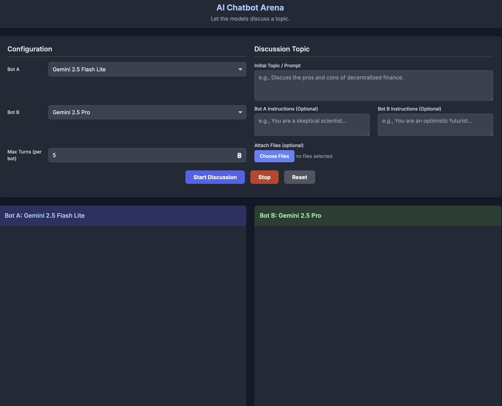

# AI Chatbot Arena 🤖

Welcome to the AI Chatbot Arena! This is a simple, self-contained web application that lets you pit two different AI chatbot models against each other in a debate-style discussion on any topic you choose.

It's designed to be incredibly easy to set up and run locally on your computer, with no web server or complex tools required.



## ✨ Features

- **Side-by-Side Discussion:** Watch two AI models discuss a topic in real-time, each in their own chat pane.
- **Attach Files:** Include the content of one or more text files directly in the initial prompt.
- **Multiple Provider Support:** Includes built-in support for models from Google (Gemini), OpenAI (ChatGPT), Anthropic (Claude), and xAI (Grok).
- **Easy Configuration:** All user settings (API keys, bot selection) are handled in a single, separate `config.js` file. No need to edit the main application code!
- **Simple & Local:** Runs entirely in your web browser. Just open the `index.html` file.
- **Customizable:** Easily add, remove, or modify the bots available in the dropdown menus by editing the `BOT_CONFIG` in your `config.js`.

## 🚀 Getting Started

Setting up the Chatbot Arena takes just a few minutes. Here’s how:

### Step 1: Get the Files

First, you need to get the project files onto your computer. You can either:
- **Download as ZIP:** Click the "Code" button on the GitHub page and select "Download ZIP". Unzip the files to a folder on your computer.
- **Clone with Git:** If you have Git installed, you can clone the repository using the command:
  ```bash
  git clone https://github.com/your-username/your-repo-name.git
  ```

### Step 2: Create Your Configuration

This is the most important step! You need to create a local configuration file for your API keys.

1.  In the project folder, find the file named `config.example.js`.
2.  **Make a copy** of this file and **rename the copy** to `config.js`.

> **Important:** The `config.js` file is where you will put your secret API keys. It is already listed in the `.gitignore` file, so you won't accidentally commit it to a public repository.

### Step 3: Add Your API Keys

Now, you need to get API keys from the AI providers you want to use.

1.  **Open `config.js`** in a text editor.
2.  You will see an `API_KEYS` section that looks like this:
    ```javascript
    const API_KEYS = {
        google: "PASTE_YOUR_GOOGLE_API_KEY_HERE",
        openai: "PASTE_YOUR_OPENAI_API_KEY_HERE",
        anthropic: "PASTE_YOUR_ANTHROPIC_API_KEY_HERE",
        // ...and so on
    };
    ```
3.  Get your keys from the official sources:
    - **Google:** Get your key from [Google AI Studio](https://aistudio.google.com/app/apikey).
    - **OpenAI:** Get your key from your [OpenAI Platform](https://platform.openai.com/api-keys) dashboard.
    - **Anthropic:** Get your key from your [Anthropic Console](https://console.anthropic.com/settings/keys) settings.
    - **xAI (Grok):** Get your key from your [xAI Developer](https://developers.x.ai/) dashboard.
4.  **Paste each key** into the corresponding placeholder in `config.js`.
5.  Save the `config.js` file.

### Step 4: Run the Application!

That's it! Simply **double-click the `index.html` file** to open it in your favorite web browser (like Chrome, Firefox, or Edge).

## ⚙️ How to Use the App

1.  **Select Bot A:** Choose the first debater from the "Bot A" dropdown.
2.  **Select Bot B:** Choose the second debater from the "Bot B" dropdown.
3.  **Set Max Turns:** Decide how many times each bot should respond.
4.  **Write a Prompt:** Enter the topic or initial question for the discussion in the "Discussion Topic" box.
5.  **(Optional) Attach Files:** Click the "Choose Files" button to select one or more text files. Their content will be added to the start of the prompt.
6.  **Click "Start Discussion"** and watch the conversation unfold!

You can use the **Stop** button to end the discussion early or the **Reset** button to clear everything and start over.

---

## ❤️ Support This Project

If you find this tool useful or fun, please consider showing your support!

<a href="https://coff.ee/themodeleer" target="_blank" rel="noopener noreferrer">
    
</a>

Feedback and suggestions are always welcome!
